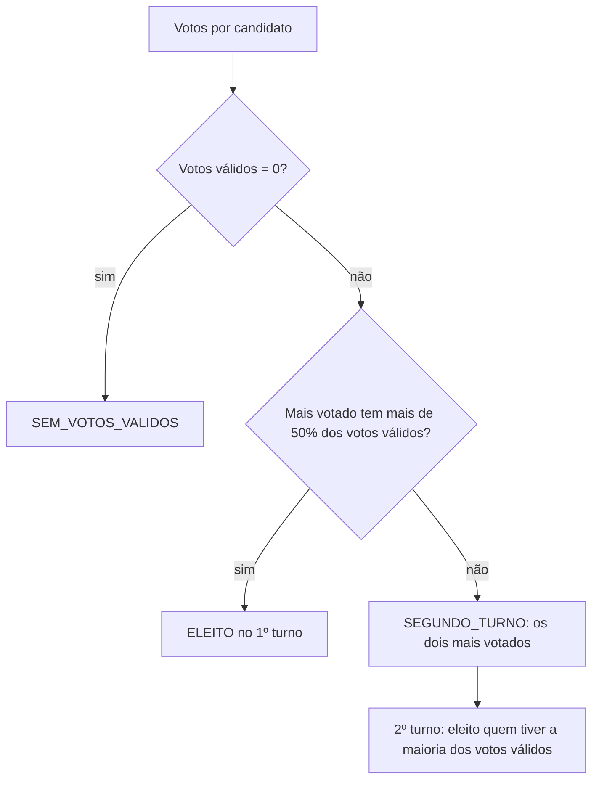
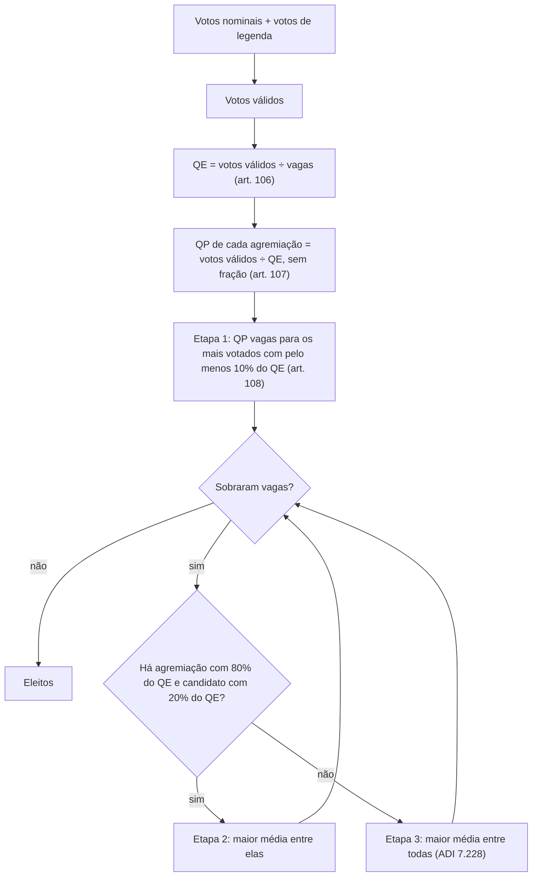

# Apuração de votos: Presidente, Deputado e Consulta pública

Este documento descreve as regras de apuração implementadas em `src/lib`, as estruturas de dados usadas e as decisões de projeto. As regras foram conferidas em 21/09/2026, às vésperas das Eleições 2026 (1º turno em 4 de outubro e 2º turno em 25 de outubro).

## 1. Conceitos comuns

- **Votos válidos**: votos dados a candidatos e, nas eleições proporcionais, às legendas. Votos **em branco e nulos nunca entram na conta** e servem só como estatística.
- **Maioria absoluta**: mais da metade dos votos válidos. Em exatamente 50% ainda não há maioria absoluta.
- **Maioria simples**: a opção com mais votos válidos.
- **Desempate por idade**: entre candidatos com a mesma votação, prevalece o **mais idoso**. Para isso o `Candidato` tem o campo opcional `dataNascimento`. Sem ele, a ordem original da lista é mantida.
- **Validação**: as funções de apuração lançam `RangeError` para votos negativos ou fracionados.

## 2. Estruturas de dados

Os tipos da feature `segundo-turno-presidente` foram mantidos. O que foi acrescentado é opcional ou novo.

### `Candidato` (`src/lib/eleicao.ts`)

| Campo | Tipo | Descrição |
| --- | --- | --- |
| `id` | `string` | Identificador do candidato |
| `nome` | `string` | Nome |
| `partido` | `string` | Sigla do partido |
| `votos` | `number` | Votos nominais |
| `dataNascimento` | `Date?` | **Novo.** Usada no desempate por idade |
| `federacao` | `string?` | **Novo.** Nome da federação partidária, quando houver |

### `VotacaoPresidente` (`src/lib/eleicao.ts`, sem alteração)

| Campo | Tipo |
| --- | --- |
| `id` | `string` |
| `data` | `Date` |
| `candidatos` | `Candidato[]` |
| `votosBrancos` | `number` |
| `votosNulos` | `number` |

O segundo turno usa a mesma estrutura, com os dois candidatos e os votos daquele turno.

### `VotacaoDeputado` (`src/lib/deputado.ts`)

Mesmo padrão de `VotacaoPresidente`, mais o número de cadeiras e os votos de legenda:

| Campo | Tipo | Descrição |
| --- | --- | --- |
| `id`, `data`, `candidatos`, `votosBrancos`, `votosNulos` | | Iguais a `VotacaoPresidente` |
| `vagas` | `number` | Cadeiras em disputa na circunscrição |
| `votosLegenda` | `Record<string, number>` | Votos só na legenda, indexados pelo nome da agremiação |

**Agremiação** é o partido ou, quando o candidato tem `federacao`, a federação (que atua como um só partido). A chave de `votosLegenda` deve ser igual a `candidato.federacao ?? candidato.partido`.

### `ConsultaPublica` (`src/lib/consulta-publica.ts`)

| Campo | Tipo | Descrição |
| --- | --- | --- |
| `id`, `data`, `votosBrancos`, `votosNulos` | | Iguais a `VotacaoPresidente` |
| `pergunta` | `string` | Texto submetido ao eleitor |
| `opcoes` | `OpcaoConsulta[]` | Cada opção tem `id`, `descricao` e `votos` (análoga a `Candidato`) |
| `eleitoresAptos` | `number?` | Opcional. Permite calcular as abstenções |

`criarConsultaSimNao(...)` monta a consulta mais comum, com as opções `SIM` e `NAO`.

## 3. Presidente

**Base legal:** CF, art. 77, §§ 2º a 5º; Lei 9.504/1997, art. 2º.

### Regras

1. É eleito no 1º turno o candidato que obtiver **maioria absoluta** dos votos válidos.
2. Sem maioria absoluta, há 2º turno entre os **dois mais votados**, e vence quem tiver a maioria dos votos válidos.
3. Se antes do 2º turno um dos dois morrer, desistir ou ficar impedido, é convocado o **remanescente de maior votação**.
4. Empate em segundo lugar: qualifica-se o **mais idoso**.

### Funções

| Função | O que faz |
| --- | --- |
| `precisaSegundoTurno(votacao)` | `true` se o mais votado não passou de 50% dos votos válidos |
| `getCandidatosSegundoTurno(votacao, idsImpedidos?)` | Os dois candidatos do 2º turno, ou `null` se não há 2º turno. `idsImpedidos` traz quem morreu, desistiu ou ficou impedido |
| `apurarPrimeiroTurno(votacao)` | Resultado completo: `status` (`ELEITO`, `SEGUNDO_TURNO` ou `SEM_VOTOS_VALIDOS`), `eleito`, `segundoTurno` e `votosValidos` |
| `apurarSegundoTurno(votacao)` | Resultado do 2º turno: `status` (`ELEITO` ou `SEM_VOTOS_VALIDOS`), `eleito` e `votosValidos` |
| `somarVotos`, `calcularPercentual`, `ordenarPorVotacao`, `validarVotos` | Funções auxiliares, reaproveitadas por `deputado.ts` e `consulta-publica.ts` |

### Decisões de projeto

- A comparação com 50% usa só inteiros (`votos * 2 <= votosValidos`), sem erro de ponto flutuante.
- Só há 2º turno quando o mais votado tem **50% ou menos** dos votos válidos. Um candidato único com votos válidos é eleito.
- No 2º turno com empate exato, vale o critério de idade por analogia (CF, art. 77, § 5º, e Código Eleitoral, art. 110), que é o entendimento do TSE para eleições majoritárias.
- `getCandidatosSegundoTurno` lança `RangeError` se, descontados os impedidos, restar menos de dois candidatos.

## 4. Deputado (eleição proporcional)

**Base legal:** CF, art. 45; Lei 9.504/1997, arts. 5º e 6º-A; Código Eleitoral, arts. 106 a 110; Res.-TSE 23.677/2021, arts. 9º a 12-A; STF, ADI 7.228, 7.263 e 7.325.

As mesmas regras valem para Deputado Federal, Estadual e Distrital. Só muda o número de vagas.

### Passo a passo

1. **Votos válidos** = votos nominais + votos de legenda de todas as agremiações.
2. **Quociente eleitoral (QE)** = votos válidos ÷ vagas. Fração igual ou inferior a meio é desprezada; superior a meio vira um inteiro a mais (art. 106).
3. **Quociente partidário (QP)** de cada agremiação = votos válidos dela (nominais + legenda) ÷ QE, **desprezada a fração** (art. 107).
4. **Etapa 1, vagas por quociente** (art. 108): cada agremiação preenche até QP vagas com seus candidatos mais votados, desde que cada um tenha **pelo menos 10% do QE**. Vagas que não puderem ser preenchidas viram sobras.
5. **Etapa 2, sobras com cláusula** (art. 109): cada vaga restante vai para a agremiação de **maior média** = votos válidos ÷ (vagas já obtidas + 1), entre as que têm **80% do QE** e um candidato ainda não eleito com **20% do QE**. A média é recalculada a cada vaga.
6. **Etapa 3, sobras sem cláusula** (ADI 7.228): quando nenhuma agremiação atende às duas exigências, as vagas restantes vão por maior média entre **todas** as agremiações que ainda têm candidatos, para seus candidatos mais votados. Vale desde as eleições de 2024. É também o que acontece se nenhum partido atingir o QE.

**Desempates**

- Candidatos com a mesma votação na mesma agremiação: o mais idoso (Código Eleitoral, art. 110).
- Médias iguais entre agremiações: a de maior votação válida; persistindo, a que tem o candidato mais votado disputando a vaga (Res.-TSE 23.677/2021, art. 11, §§ 6º e 7º).

### Funções

| Função | O que faz |
| --- | --- |
| `calcularQuocienteEleitoral(votosValidos, vagas)` | QE com a regra de arredondamento do art. 106 |
| `calcularQuocientePartidario(votosValidosAgremiacao, quocienteEleitoral)` | QP, sem fração |
| `apurarDeputados(votacao)` | Apuração completa: `votosValidos`, `quocienteEleitoral`, `agremiacoes` (com QP, vagas por quociente, vagas por sobra e eleitos) e `eleitos` |
| `getDeputadosEleitos(votacao)` | Só a lista de eleitos, em ordem decrescente de votação nominal |
| `VAGAS_DEPUTADO_FEDERAL` | Vagas de Deputado Federal por UF nas Eleições 2026 |

### Exemplo trabalhado

8 vagas e 80.000 votos válidos, logo **QE = 10.000** (10% = 1.000; 20% = 2.000; 80% = 8.000). É o cenário de teste de `tests/unit/deputado.test.ts`.

| Agremiação | Votos nominais | Legenda | Votos válidos | QP |
| --- | --- | --- | --- | --- |
| Federação Alfa (A1 + A2) | 34.500 | 6.500 | 41.000 | 4 |
| PB | 13.400 | 9.600 | 23.000 | 2 |
| PC | 7.900 | 3.600 | 11.500 | 1 |
| PD | 3.500 | 1.000 | 4.500 | 0 |

- **Etapa 1:** a Federação Alfa elege seus 4 mais votados (a1 a a4). O PB tem QP 2, mas só b1 (12.000) passa de 1.000 votos: b2 tem 900 e **não pode ocupar vaga de quociente**, então uma vaga do PB vira sobra. O PC elege c1. Foram preenchidas 6 vagas, restam 2.
- **Etapa 2:** só a Federação Alfa tem 80% do QE e candidato com 20% do QE (a5, com 3.000). A média dela é 41.000 ÷ 5 = 8.200, e ela elege a5. Depois disso ninguém mais atende às duas exigências (a6 tem 1.500).
- **Etapa 3:** disputam todas as agremiações com candidatos. Médias: PB 23.000 ÷ 3 = 7.666,7; Federação Alfa 41.000 ÷ 6 = 6.833,3; PC 11.500 ÷ 2 = 5.750; PD 4.500 ÷ 1 = 4.500. O PB vence e elege b2, com 900 votos.

Eleitos: 5 da Federação Alfa, 2 do PB e 1 do PC.

### Decisões de projeto

- Todas as comparações com 10%, 20% e 80% do QE e com as médias usam só inteiros (multiplicação cruzada).
- A vaga por quociente que fica sem candidato apto **continua contando** nas vagas já obtidas, no denominador da média (Res.-TSE 23.677/2021, art. 11, § 5º).
- Se as agremiações não tiverem candidatos suficientes, as vagas restantes ficam sem preenchimento e a função não lança erro.
- `apurarDeputados` lança `RangeError` se o QP somado exceder as vagas. Isso só ocorre com números muito pequenos (QE menor que metade das vagas) e indica dado inconsistente.
- `VAGAS_DEPUTADO_FEDERAL` soma **513** cadeiras (mínimo de 8 e máximo de 70 por UF). O projeto que ampliava a Câmara para 531 foi vetado e o STF manteve o número atual para 2026. Confira se houve mudança antes de reutilizar a tabela em outra eleição.

## 5. Consulta pública

**Base legal:** CF, art. 14, I e II; Lei 9.709/1998, arts. 2º e 10; Res.-TSE 23.385/2012, arts. 34 e 35.

No direito eleitoral brasileiro a consulta feita aos eleitores por voto é a **consulta popular**, que pode ser **plebiscito** (antes do ato) ou **referendo** (depois do ato). Foi essa a interpretação adotada para "consulta pública". A consulta pública administrativa (Lei 9.784/1999, art. 31) não tem votação nem regra de apuração, por isso não foi modelada.

### Regras

1. A proposta é aprovada ou rejeitada por **maioria simples**.
2. Votos em branco e nulos não são computados, mas o relatório da consulta informa eleitores aptos, comparecimento, brancos e nulos.

### Funções

| Função | O que faz |
| --- | --- |
| `apurarConsulta(consulta)` | Retorna `status` (`VENCEDORA`, `EMPATE` ou `SEM_VOTOS_VALIDOS`), `vencedora`, `empatadas`, `votosValidos`, `percentuais` por opção, `comparecimento` e `abstencoes` |
| `consultaAprovada(consulta)` | Para consultas Sim/Não: `true` só se o `SIM` tiver a maioria simples |
| `criarConsultaSimNao(dados)` | Monta uma `ConsultaPublica` com as opções `SIM` e `NAO` |

### Decisões de projeto

- A estrutura aceita **mais de duas opções**. Vence a mais votada, mesmo com menos de 50%.
- A lei não prevê empate. Nesse caso o resultado é `EMPATE`, sem vencedora, e `consultaAprovada` retorna `false`, porque nenhuma opção obteve a maioria.
- `comparecimento` = votos válidos + brancos + nulos. `abstencoes` só é calculada se `eleitoresAptos` for informado, e a função lança `RangeError` se o comparecimento superar o eleitorado apto.
- Não é aplicado quórum mínimo de comparecimento: o art. 10 da Lei 9.709/1998 exige apenas maioria simples. As regras próprias de criação, fusão e desmembramento de estados e municípios (CF, art. 18, §§ 3º e 4º) não foram modeladas.

## 6. Fora do escopo

- Eleição de Senador, Governador e Prefeito.
- Suplentes.
- Cláusula de desempenho dos partidos (CF, art. 17, § 3º), que afeta o acesso a fundo partidário e tempo de propaganda, não a distribuição das cadeiras.
- Tabela de vagas de Deputado Estadual e Distrital (CF, arts. 27 e 32): basta informar `vagas`.
- Interface de votação e persistência dos resultados (Firebase).

## 7. Referências

- Constituição Federal, arts. 14, 17, 45 e 77.
- Lei 9.504/1997 (Lei das Eleições), arts. 2º, 5º e 6º-A.
- Código Eleitoral (Lei 4.737/1965), arts. 106 a 110.
- Lei 9.709/1998 (plebiscito e referendo).
- Res.-TSE 23.677/2021 (com a redação dada pela Res.-TSE 23.734/2024) e Res.-TSE 23.385/2012.
- STF, ADI 7.228, 7.263 e 7.325, julgadas em 28/02/2024.
